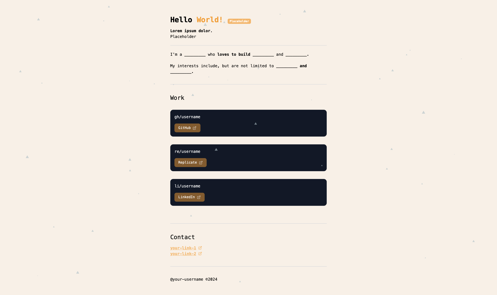

# minimalistic-portfolio

A minimalistic and modern web app portfolio built with Next.js 14. This project showcases a sleek design, integrating interactive elements using `react-particles` and `tsparticles`, and styled with the power of Tailwind CSS.

## [live demo deployed on Vercel](https://minimalistic-portfolio-two.vercel.app)



## Use it as a Template

To kickstart your own project, simply utilize the GitHub feature  ━  **Use this template**. This approach allows you to create a new repository in your account with the same directory structure, but without carrying over the git commit history. 

## Features

- **Next.js 14**: Leveraging the latest features of Next.js for fast, server-rendered React applications.
- **React Particles**: Interactive particle animations for a dynamic user interface.
- **Tailwind CSS**: Customizable styling with the utility-first CSS framework.
- **TypeScript Support**: Strongly typed codebase for better development experience.
- **ESLint**: Integrated linting for consistent code quality.
- **Responsive Design**: Ensures a great user experience on devices of all sizes.

## Running Locally

To get the portfolio up and running on your local machine, follow these steps:

1. **Clone the Repository**:
   ```bash
   git clone https://github.com/martintomov/minimalistic-portfolio.git
   ```

2. **Install Dependencies**:
   ```bash
   npm install
   ```

3. **Start the Development Server**:
   ```bash
   npm run dev
   ```

4. **Access the Application**: The application will be available at `http://localhost:3000`.

Enjoy building your portfolio!
